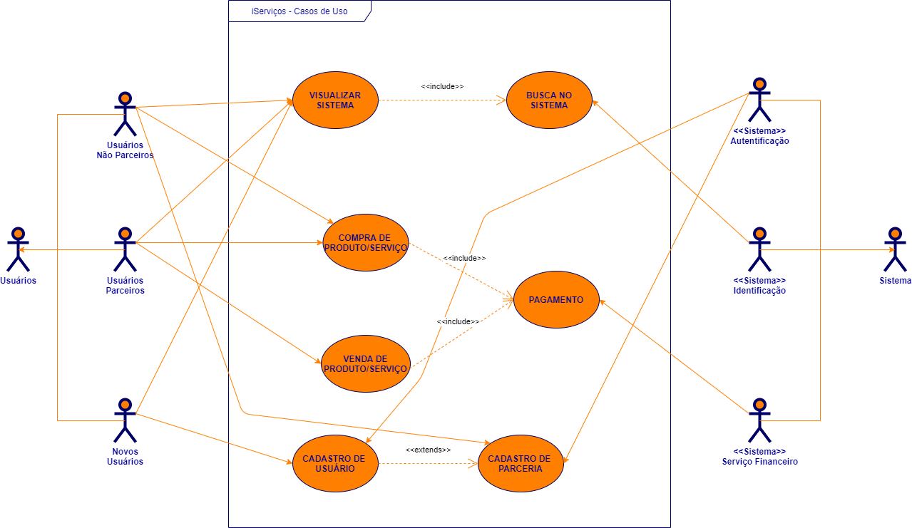
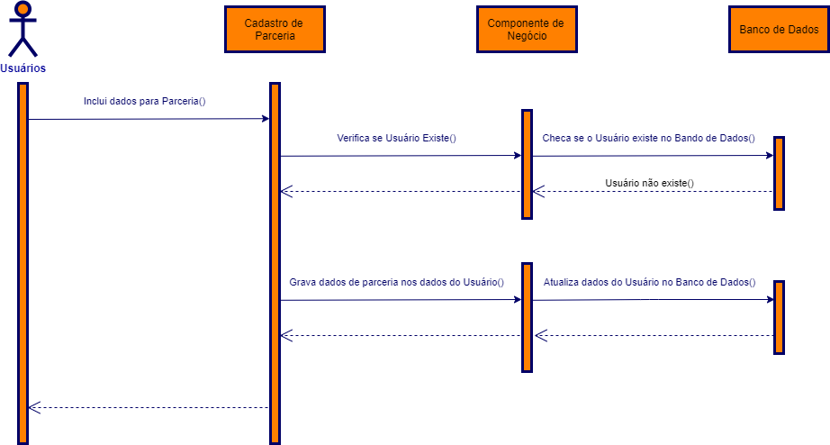
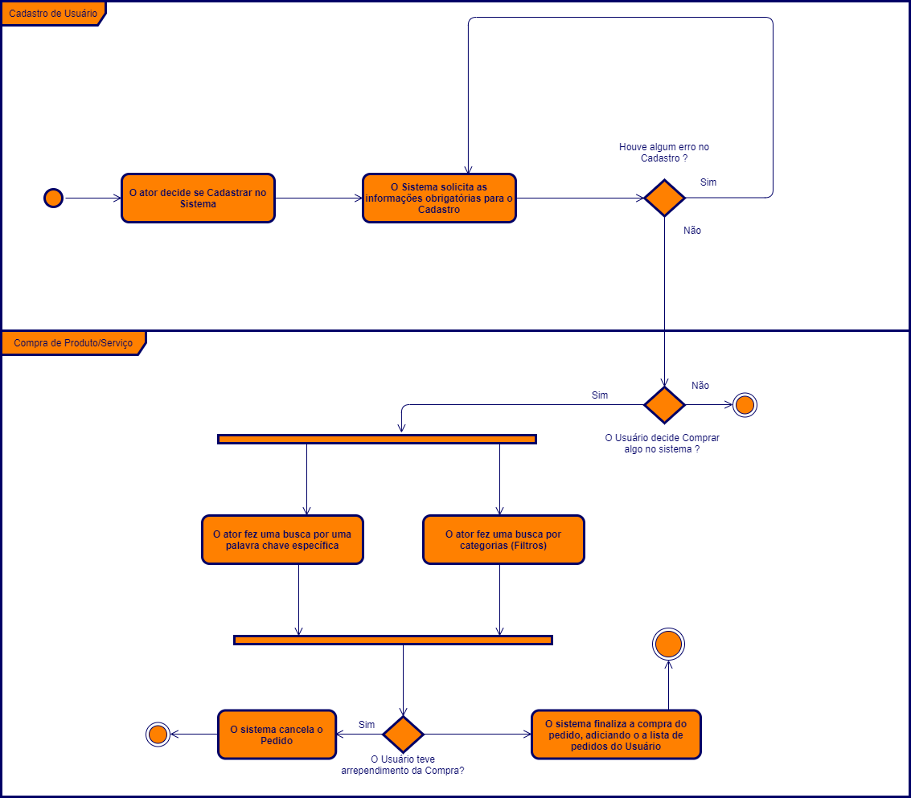
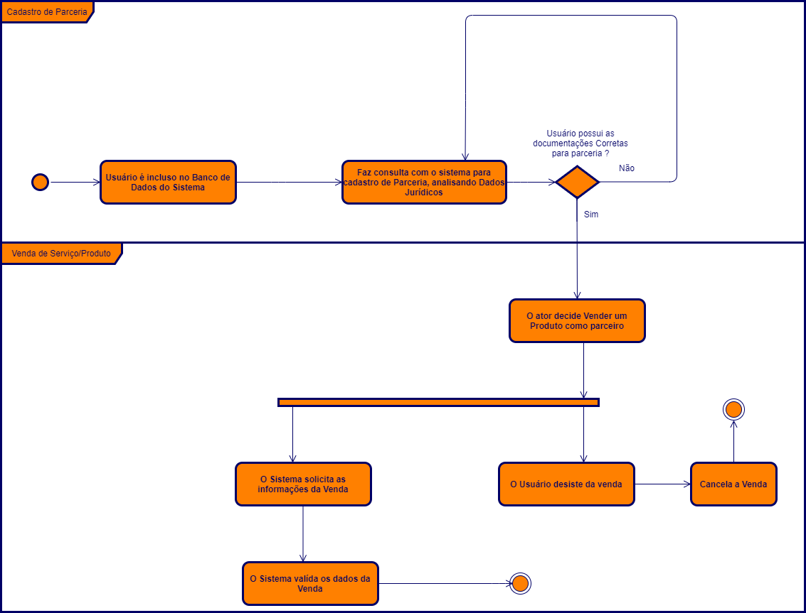

# Diagramas

# Conclusão

Durante o desenvolvimento do projeto, foi percebi a utilização dos diversos conhecimentos formados ao longo do semestre. Este projeto proporcionou principalmente a aplicação dos conhecimentos de Analise de Requisitos.

A utilização do UML para os Diagramas neste trabalho demonstrou uma demanda de trabalho e tempo grande, mostrando ao final uma melhor visualização de como será o sistema antes de apresentar os resultados.

# Problemas Encontrados

* Para que o sistema seja comercializado,  tem a necessidade de novas implementações e alterações que possa adequar à realidade das pessoas interessadas.

* Dificuldades na visualização dos Diagramas inicialmente.

* Falta de ideia Inovadora para diferenciar o aplicativo dos outros já existentes.